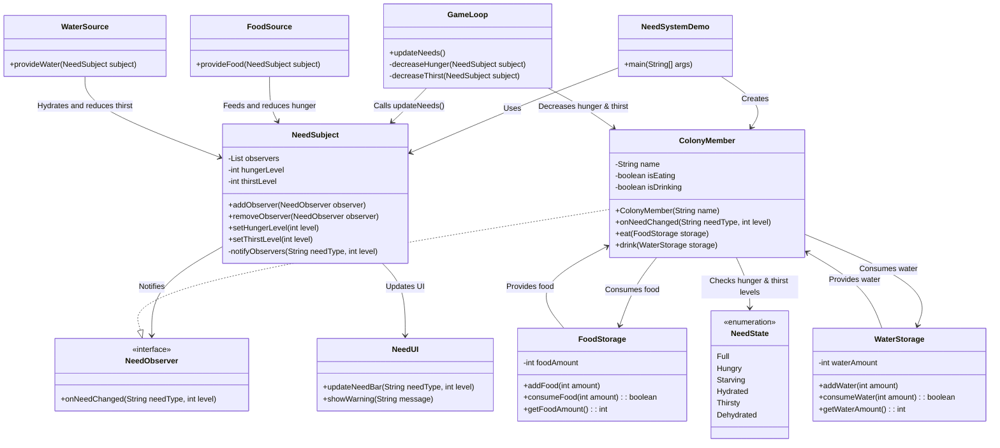

```mermaid

classDiagram
    class NeedObserver {
        <<interface>>
        +onNeedChanged(String needType, int level)
    }

    class NeedSubject {
        -List<NeedObserver> observers
        -int hungerLevel
        -int thirstLevel
        +addObserver(NeedObserver observer)
        +removeObserver(NeedObserver observer)
        +setHungerLevel(int level)
        +setThirstLevel(int level)
        -notifyObservers(String needType, int level)
    }

    class NeedState {
        <<enumeration>>
        Full
        Hungry
        Starving
        Hydrated
        Thirsty
        Dehydrated
    }

    class ColonyMember {
        -String name
        -boolean isEating
        -boolean isDrinking
        +ColonyMember(String name)
        +onNeedChanged(String needType, int level)
        +eat(FoodStorage storage)
        +drink(WaterStorage storage)
    }

    class NeedUI {
        +updateNeedBar(String needType, int level)
        +showWarning(String message)
    }

    class NeedSystemDemo {
        +main(String[] args)
    }

    class GameLoop {
        +updateNeeds()
        -decreaseHunger(NeedSubject subject)
        -decreaseThirst(NeedSubject subject)
    }

    class FoodStorage {
        -int foodAmount
        +addFood(int amount)
        +consumeFood(int amount) : boolean
        +getFoodAmount() : int
    }

    class WaterStorage {
        -int waterAmount
        +addWater(int amount)
        +consumeWater(int amount) : boolean
        +getWaterAmount() : int
    }

    class FoodSource {
        +provideFood(NeedSubject subject)
    }

    class WaterSource {
        +provideWater(NeedSubject subject)
    }

    NeedSubject --> NeedObserver : Notifies
    ColonyMember ..|> NeedObserver
    NeedSystemDemo --> NeedSubject : Uses
    NeedSystemDemo --> ColonyMember : Creates
    GameLoop --> NeedSubject : Calls updateNeeds()
    GameLoop --> ColonyMember : Decreases hunger & thirst
    FoodStorage --> ColonyMember : Provides food
    WaterStorage --> ColonyMember : Provides water
    ColonyMember --> FoodStorage : Consumes food
    ColonyMember --> WaterStorage : Consumes water
    FoodSource --> NeedSubject : Feeds and reduces hunger
    WaterSource --> NeedSubject : Hydrates and reduces thirst
    ColonyMember --> NeedState : Checks hunger & thirst levels
    NeedSubject --> NeedUI : Updates UI


```