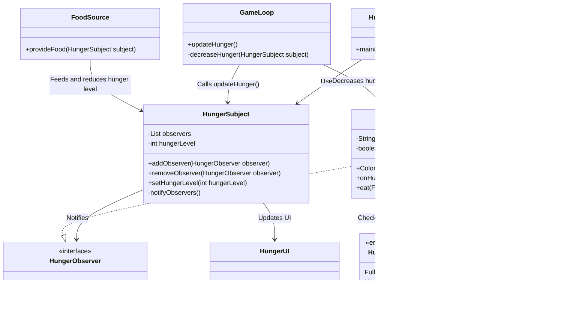

```mermaid

classDiagram
    class HungerObserver {
        <<interface>>
        +onHungerChanged(int hungerLevel)
    }

    class HungerSubject {
        -List<HungerObserver> observers
        -int hungerLevel
        +addObserver(HungerObserver observer)
        +removeObserver(HungerObserver observer)
        +setHungerLevel(int hungerLevel)
        -notifyObservers()
    }

    class HungerState {
        <<enumeration>>
        Full
        Hungry
        Starving
    }

    class ColonyMember {
        -String name
        -boolean isEating
        +ColonyMember(String name)
        +onHungerChanged(int hungerLevel)
        +eat(FoodStorage storage)
    }

    class HungerUI {
        +updateHungerBar(int hungerLevel)
        +showWarning(String message)
    }

    class HungerSystemDemo {
        +main(String[] args)
    }

    class GameLoop {
        +updateHunger()
        -decreaseHunger(HungerSubject subject)
    }

    class FoodStorage {
        -int foodAmount
        +addFood(int amount)
        +consumeFood(int amount) : boolean
        +getFoodAmount() : int
    }

    class FoodSource {
        +provideFood(HungerSubject subject)
    }

    HungerSubject --> HungerObserver : Notifies
    ColonyMember ..|> HungerObserver
    HungerSystemDemo --> HungerSubject : Uses
    HungerSystemDemo --> ColonyMember : Creates
    GameLoop --> HungerSubject : Calls updateHunger()
    GameLoop --> ColonyMember : Decreases hunger
    FoodStorage --> ColonyMember : Provides food
    ColonyMember --> FoodStorage : Consumes food
    FoodSource --> HungerSubject : Feeds and reduces hunger level
    ColonyMember --> HungerState : Checks hunger level
    HungerSubject --> HungerUI : Updates UI


```