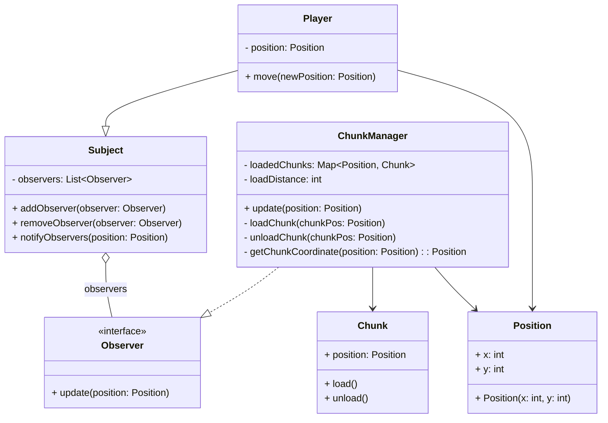

```mermaid
classDiagram
    class Subject {
         - observers: List~Observer~
         + addObserver(observer: Observer)
         + removeObserver(observer: Observer)
         + notifyObservers(position: Position)
    }
    class Observer {
         <<interface>>
         + update(position: Position)
    }
    class Player {
         - position: Position
         + move(newPosition: Position)
    }
    class ChunkManager {
         - loadedChunks: Map~Position, Chunk~
         - loadDistance: int
         + update(position: Position)
         - loadChunk(chunkPos: Position)
         - unloadChunk(chunkPos: Position)
         - getChunkCoordinate(position: Position): Position
    }
    class Chunk {
         + position: Position
         + load()
         + unload()
    }
    class Position {
         + x: int
         + y: int
         + Position(x: int, y: int)
    }
    
    Player --|> Subject
    ChunkManager ..|> Observer
    Subject o-- Observer : observers
    Player --> Position
    ChunkManager --> Position
    ChunkManager --> Chunk
```
